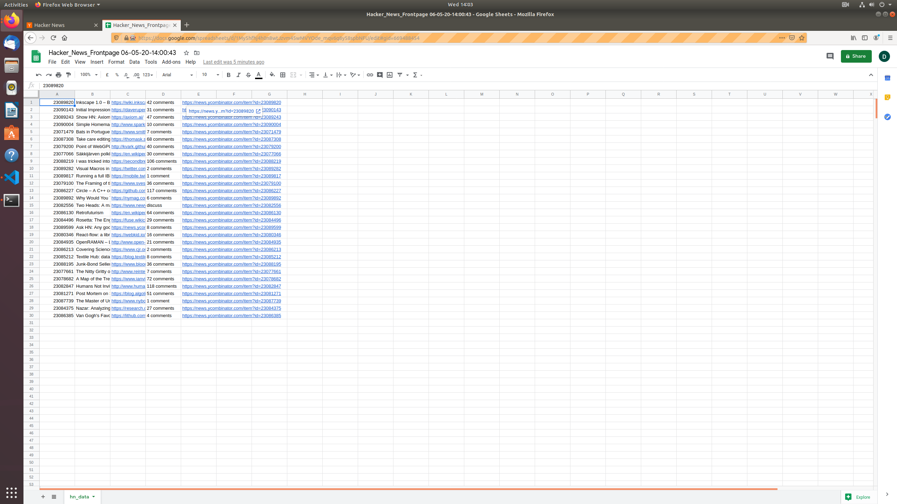

# Log front pages

Demo 

Watch on YouTube by clicking the thumbnail below or alternatively download the video file from this repository

This script scrapes Hacker News frontpage, stores
the data in a json format which is then converted in a Google Sheets
friendly format - csv. Once the file has been written it will go to
Google and sign in the user. In this example I am using env variables
for my username and password. Once signed in, it will create a blank
sheet and will dump the collected data as well as rename the file with
the current timestamp.

This script can be converted to fetch data from similar layout websites
like Reddit for example.

## How to use
1. Download the `hn-automation.rb`
2. If you are using `Zsh` run those commands:
* `echo 'export EMAIL_ADDRESS=foo@bar.com' >> ~/.zshenv`
* `echo 'export EMAIL_PASSWORD=foobar123' >> ~/.zshenv`

Run these if you are using Bash
* `echo 'export EMAIL_ADDRESS=foo@bar.com' >> ~/.bash_profile`
* `echo 'export EMAIL_PASSWORD=foobar123' >> ~/.bash_profile`
3. Run `ruby hn-automation.rb`
